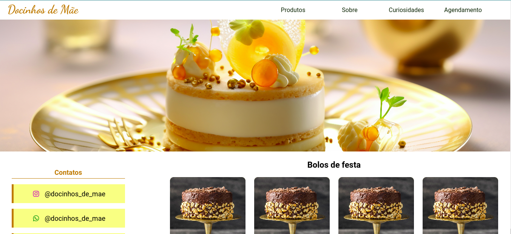
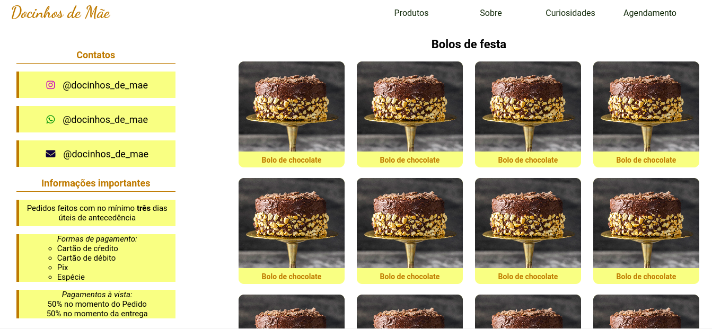
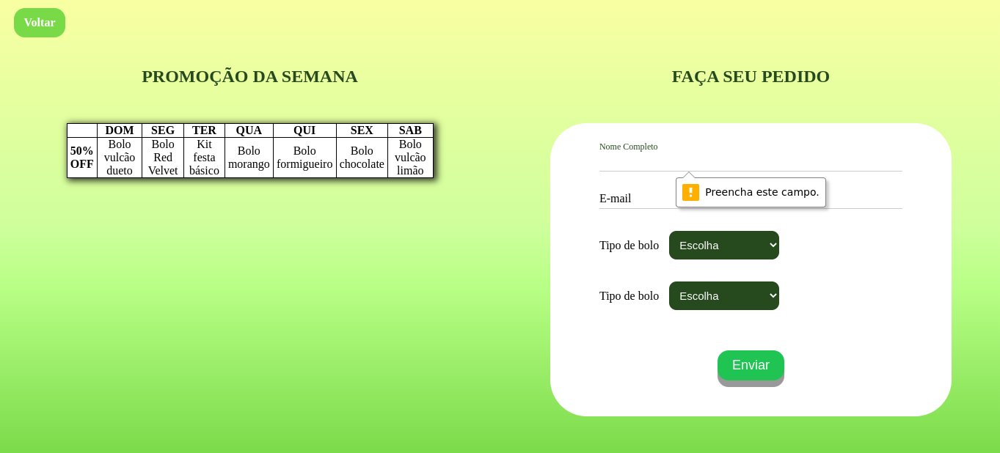

# Exercício 4 | Projeto #1: Vem Ser Tech - Front End | Ada Tech

## Sobre

O projeto se trata de um front end estático básico, utilizando apenas HTML5 e CSS vanilla. Esse projeto foi desenvolvido com intuito de realizar uma atividade de entrega do curso Front end, na Ada Tech. O objetivo do projeto foi o desenvolvimento de um site utilizando tags semânticas. Tendo como requisitos obrigatórios o uso da header, main, footer, aside, article, section, figure, figurecaption, table, form e nav. Além disso, tinha como objetivo adicional a navegação pela página utilizando #id.

_____

### Como executar o projeto em desenvolvimento

1. Clone esse repositório 
```
git@github.com:BrendaRSS/exercise-four-adatech-project-1-static-frontend.git
```
2. Acesse a página pelo seu navegador (pode utilizar extensões como Live Server)

### Imagens do projeto
<div>
    
    
    
</div>
